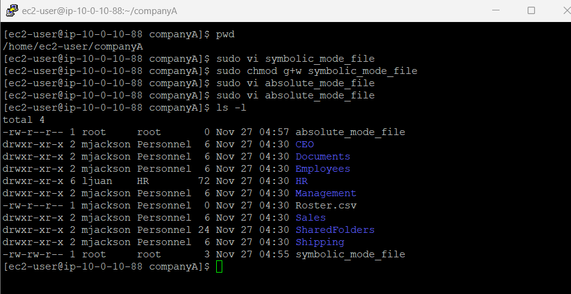
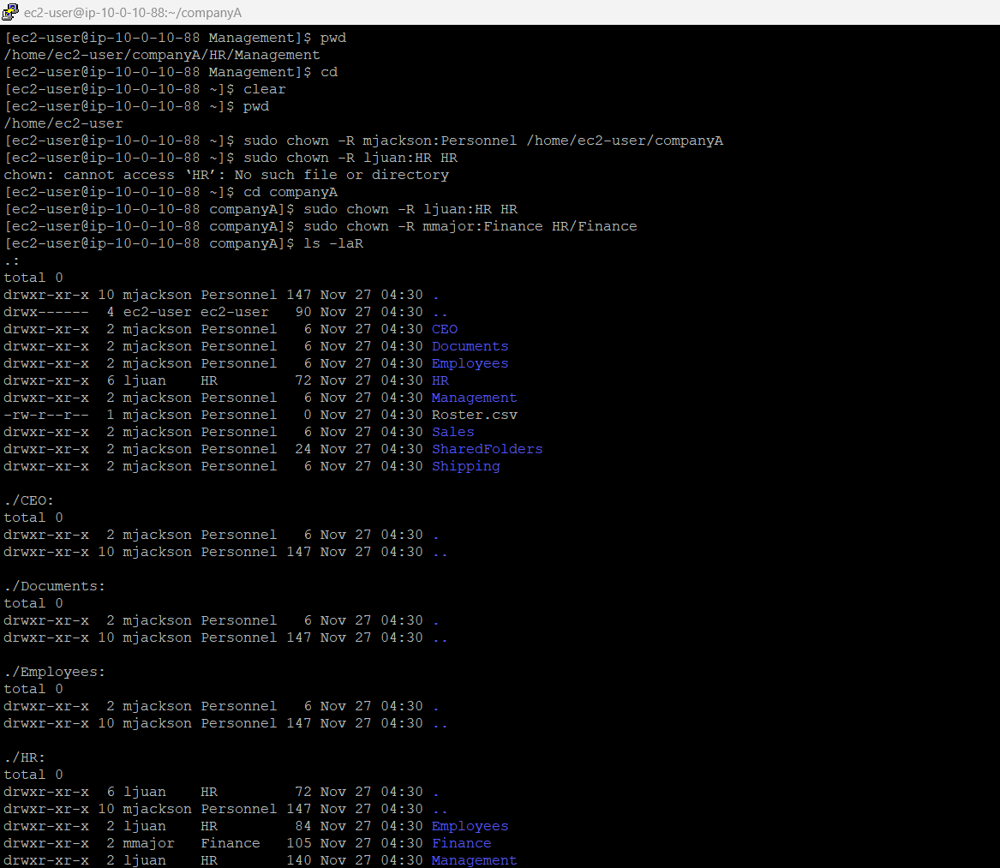
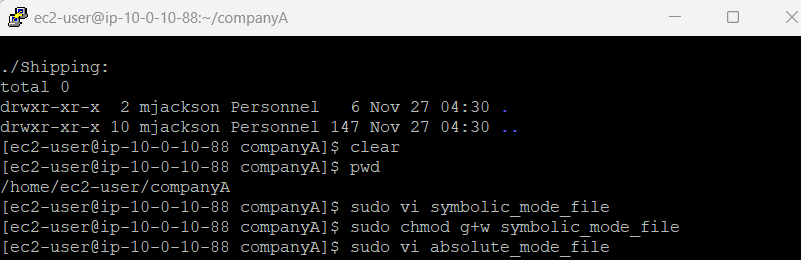
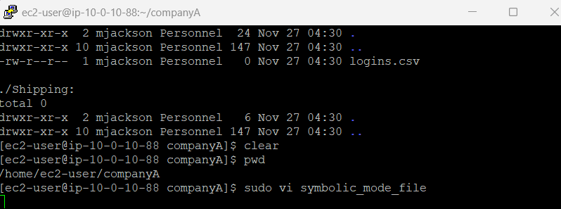

# 🔐 Managing File Permissions in Linux

> **Mastering Linux file permissions—the foundation of system security and multi-user environments.**

---

## 📋 What's Inside

- [What I Built Here](#what-i-built-here)
- [Understanding Linux Permissions](#understanding-linux-permissions)
- [Working with Permission Commands](#working-with-permission-commands)
- [Ownership Management](#ownership-management)
- [Advanced Permission Concepts](#advanced-permission-concepts)
- [What I Learned](#what-i-learned)

---

## What I Built Here

This lab covered Linux file permissions—the security model that controls who can read, write, and execute files on a Linux system.

The real point here wasn't just running chmod commands—it was understanding the security implications:  
✅ **Permission modes** (symbolic and numeric notation)  
✅ **Ownership management** using chown and chgrp  
✅ **Special permissions** like setuid, setgid, and sticky bits  
✅ **Real-world security** patterns for multi-user environments

**Tech Stack:** Amazon Linux 2023, AWS Cloud9 IDE, Bash

---

## Understanding Linux Permissions

### The Permission Model

Linux uses a permission system based on three types of users and three types of access:

**User Types:**
- **Owner (u)** — The user who owns the file
- **Group (g)** — Users in the file's group
- **Others (o)** — Everyone else on the system

**Permission Types:**
- **Read (r)** — View file contents or list directory contents
- **Write (w)** — Modify file contents or create/delete files in a directory
- **Execute (x)** — Run a file as a program or access a directory

<p align="center">
  
</p>

*Visual representation of Linux permission structure: owner, group, and others*

### Reading Permission Strings

When you run `ls -l`, you see permission strings like this:

```
-rwxr-xr--  1 user  group  1234 Nov 27 10:00 filename.txt
```

**Breaking it down:**
- `-` — File type (- = regular file, d = directory, l = symbolic link)
- `rwx` — Owner permissions (read, write, execute)
- `r-x` — Group permissions (read, no write, execute)
- `r--` — Others permissions (read only)

<p align="center">
  
</p>

*Amazon Linux terminal showing file permissions with ls -l command*

Honestly, once you understand this format, managing permissions becomes second nature.

---

## Working with Permission Commands

### Using chmod: Changing Permissions

The `chmod` command changes file permissions. You can use either **symbolic** or **numeric** notation.

#### Symbolic Mode

```bash
# Add execute permission for owner
chmod u+x filename

# Remove write permission for group
chmod g-w filename

# Set read-only for others
chmod o=r filename

# Add execute for everyone
chmod a+x filename
```

<p align="center">
  
</p>

*Using chmod to modify file permissions in symbolic mode*

#### Numeric (Octal) Mode

Each permission has a numeric value:
- **Read (r)** = 4
- **Write (w)** = 2
- **Execute (x)** = 1

You add these together for each user type:

| Permission | Calculation | Octal |
|------------|-------------|-------|
| rwx | 4 + 2 + 1 | 7 |
| rw- | 4 + 2 + 0 | 6 |
| r-x | 4 + 0 + 1 | 5 |
| r-- | 4 + 0 + 0 | 4 |
| -wx | 0 + 2 + 1 | 3 |
| -w- | 0 + 2 + 0 | 2 |
| --x | 0 + 0 + 1 | 1 |
| --- | 0 + 0 + 0 | 0 |

**Common permission sets:**

```bash
# 755: Owner full access, others read/execute only
# Perfect for scripts and executables
chmod 755 script.sh

# 644: Owner read/write, others read-only
# Standard for regular files
chmod 644 document.txt

# 600: Owner read/write only, no access for others
# Ideal for sensitive files like SSH keys
chmod 600 ~/.ssh/id_rsa

# 700: Owner full access only
# Best for private directories
chmod 700 ~/private/
```

---

## Ownership Management

### Using chown: Changing File Owner

The `chown` command changes file ownership. You need sudo privileges to change ownership to another user.

```bash
# Change owner only
sudo chown newuser filename

# Change owner and group
sudo chown newuser:newgroup filename

# Change ownership recursively for directories
sudo chown -R newuser:newgroup /path/to/directory
```

<p align="center">
  
</p>

*Using chown to transfer file ownership between users*

### Using chgrp: Changing Group Ownership

```bash
# Change group ownership
chgrp developers project.txt

# Change group recursively
chgrp -R devteam /opt/project/
```

**Why This Matters:**
In production environments, proper ownership is critical:
- Web server files owned by `www-data` or `nginx`
- Application files owned by service accounts
- Shared directories with group ownership for team access

---

## Advanced Permission Concepts

### Special Permission Modes

Beyond the basic read/write/execute permissions, Linux has three special modes:

#### 1. Setuid (Set User ID) - 4000

When set on an executable, the program runs with the owner's privileges instead of the executor's.

```bash
# Set setuid bit
chmod u+s /usr/bin/program
# or
chmod 4755 /usr/bin/program
```

<p align="center">
  
</p>

*Setting special permission modes on files*

**Example:** The `passwd` command has setuid so users can change their password (which requires writing to `/etc/shadow`, a root-owned file).

#### 2. Setgid (Set Group ID) - 2000

When set on a directory, new files inherit the directory's group instead of the creator's primary group.

```bash
# Set setgid on directory
chmod g+s /shared/project/
# or
chmod 2775 /shared/project/
```

<p align="center">
  
</p>

*Creating files with symbolic mode permissions*

#### 3. Sticky Bit - 1000

When set on a directory, only the file owner can delete or rename files within it—even if others have write permission.

```bash
# Set sticky bit (common on /tmp)
chmod +t /shared/temp/
# or
chmod 1777 /shared/temp/
```

**Real-World Use Case:** The `/tmp` directory has the sticky bit set so users can't delete each other's temporary files.

---

## Security & Verification

### Terminal Access

<p align="center">
  
</p>

*Configuring terminal access to the Linux environment*

### System Login Verification

<p align="center">
  
</p>

*Successfully logged into the Linux environment for permissions management*

### Testing Permission Changes

```bash
# Verify current permissions
ls -l filename

# Test file access
cat filename

# Verify ownership
ls -l filename | awk '{print $3, $4}'
```

**Common Permission Patterns:**

| Use Case | Permission | Command |
|----------|------------|---------|
| SSH private key | 600 | `chmod 600 ~/.ssh/id_rsa` |
| Shell script | 755 | `chmod 755 script.sh` |
| Configuration file | 644 | `chmod 644 config.yml` |
| Sensitive data | 600 | `chmod 600 secrets.txt` |
| Shared directory | 2775 | `chmod 2775 /shared/project` |
| Public web files | 644 | `chmod 644 index.html` |
| Private directory | 700 | `chmod 700 ~/private` |

---

## What I Learned

### Technical Skills I Practiced

🛠️ **Linux Security Fundamentals**
- Understanding the Unix permission model
- Reading and interpreting permission strings
- Applying the principle of least privilege

🛠️ **Permission Management**
- Using chmod with both symbolic and numeric notation
- Choosing appropriate permission sets for different file types
- Understanding when to use 755 vs 644 vs 600

🛠️ **Ownership Control**
- Managing file and directory ownership with chown
- Working with group ownership using chgrp
- Understanding the security implications of ownership changes

🛠️ **Advanced Concepts**
- Working with special permission modes (setuid, setgid, sticky bit)
- Understanding when and why to use special permissions
- Recognizing security risks and proper mitigation

### The Real Takeaway

This project isn't complicated, but it touches on everything that matters when you're managing Linux systems:

- 🎯 Understanding how Linux controls file access at a fundamental level
- 🎯 Balancing security requirements with usability
- 🎯 Applying proper permissions to prevent security vulnerabilities
- 🎯 Managing multi-user environments effectively

Honestly, file permissions seemed like dry sysadmin stuff at first. But once I started thinking about real-world scenarios, it clicked:

**Real-world examples:**
- **SSH key:** `chmod 600 ~/.ssh/id_rsa` (too open = SSH rejects it)
- **Web files:** `chown -R www-data:www-data /var/www/html` (wrong owner = 403 errors)
- **Backup scripts:** `chmod 700 backup.sh` (executable by owner only = security)
- **Shared team directory:** `chmod 2775 /opt/shared` (setgid = preserved group ownership)

The key insight: **Linux permissions are the foundation of system security. Get this wrong and nothing else matters.**

---

## 📊 Project Status

This is part of my **AWS Restart Journey**, a three-month focused portfolio documenting my path to the AWS Cloud Practitioner certification and beyond.

I'm building real projects, not just following tutorials. The goal is to prove I can actually build things, not just pass exams.

---

## 🤝 Let's Connect

If you're looking for someone who's serious about learning AWS the right way—hands-on, documented, and grounded in real-world architecture—let's talk.

<p align="center">
  <a href="mailto:leroym.biz@gmail.com">
    
  </a>
  <a href="https://api.whatsapp.com/send/?phone=27605665116&text=Hi%20Leroy,%20saw%20your%20GitHub!" target="_blank">
    
  </a>
</p>

<p align="center">
  <a href="https://github.com/leroym-biz/AWS-restart-journey" target="_blank">
    
  </a>
</p>

---

<p align="center">
  
  
</p>

<h4 align="center">🔐 Built with Linux • AWS Cloud9 • File Permissions • Real-World Security 🚀</h4>