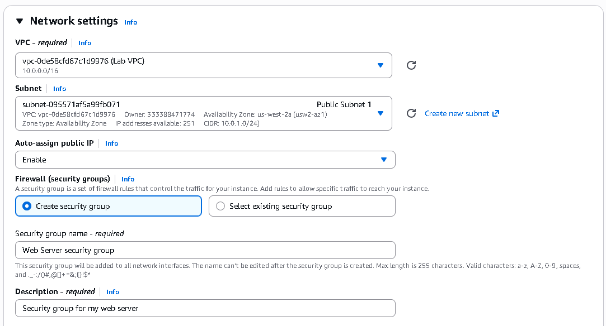

📡 AWS EC2 Launch and Web Server Demo

Provisioning an EC2 instance and setting up a web server from scratch—the kind of stuff you actually do on the job.

📑 What's Inside

What I Built Here

Architecture Overview

Launch Configuration Details

The Automation Script

Security & Verification

What I Learned

What I Built Here

This lab is pretty straightforward but covers the essentials: I spun up an Amazon EC2 instance and configured it to run a simple Apache web server.

The real point here wasn't just getting a server online—it was doing it the right way:

🔹 Automated setup using User Data scripts (no manual SSH needed)

🔹 Security-first thinking with proper Security Group configuration

🔹 Cost-conscious design using Free Tier resources

🔹 High availability patterns with multi-AZ architecture

Tech Stack: AWS EC2, Amazon Linux 2023, Apache HTTP Server, Bash scripting

Architecture Overview

How It's Built

The EC2 instance lives inside a specific Availability Zone (AZ) and uses Amazon EBS for storage that sticks around even if the instance goes down. This setup follows the kind of resilient, multi-AZ patterns you see in production environments.

Multi-AZ EC2 architecture showing compute modules across availability zones with EBS storage

The Key Pieces:

Compute Layer: EC2 instances spread across multiple AZs for reliability

Storage Layer: Amazon EBS volumes—your data persists even if things crash

Network Layer: Custom VPC with proper subnet isolation

Security Layer: Security Groups acting as your virtual firewall

Honestly, getting comfortable with this architecture is half the battle when you're learning AWS.

Launch Configuration Details

Instance Specs

Component

What I Used

Why It Makes Sense

AMI

Amazon Linux 2023

AWS-optimized OS with the latest security patches. Just works better with AWS services.

Instance Type

t2.micro (Free Tier)

1 vCPU and 1 GB RAM—more than enough for a demo web server and keeps costs at zero.

VPC

Lab VPC

Isolated network so I can control exactly who gets in and out.

Storage

8 GB EBS (gp3)

General-purpose SSD. Fast enough for web serving without overpaying.

Availability Zone

User-selected

Lets you think about high availability and disaster recovery from day one.

Network & Security Configuration

Security Group Rules

I followed the principle of least privilege here—only open what you absolutely need:

Rule Type

Protocol

Port

Source

What It Does

Inbound

SSH

22

My IP / Lab CIDR

Lets me SSH in for admin tasks (optional)

Inbound

HTTP

80

0.0.0.0/0

Opens the web server to the public internet

Outbound

All

All

0.0.0.0/0

Lets the instance download updates and packages

Security Group configuration in AWS Console showing inbound and outbound rules

Security Best Practices I Applied:

🛡️ Limited SSH access to known IP ranges only

🛡️ No unnecessary ports left open

🛡️ Security Groups acting as a stateful firewall

🛡️ Regular OS updates via the User Data script

The Security Group is basically your first line of defense. Get this wrong and you're either locked out or wide open to the internet. Neither is great.

The Automation Script

User Data Bootstrap Script

This is where the magic happens. Instead of manually SSH-ing in and running commands, I wrote a Bash script that runs automatically when the instance first boots.

This is Infrastructure as Code thinking—write it once, run it a hundred times, always get the same result.

#!/bin/bash
# ===========================================
# EC2 Web Server Bootstrap Script
# Automates Apache installation and config
# ===========================================

# Update all system packages to latest versions
sudo yum update -y

# Install Apache web server
sudo yum install httpd -y

# Start the Apache service immediately
sudo systemctl start httpd

# Enable Apache to start automatically on system boot
sudo systemctl enable httpd

# Create a custom landing page
echo "<h1>Hello from AWS EC2! This is a successful web server launch.</h1>" > /var/www/html/index.html

Why This Approach Matters:

⚙️ Repeatable: Run this on 10 instances, get 10 identical web servers

⚙️ No manual work: Fire-and-forget deployment

⚙️ Version-controlled: Stick this in Git and you've got an audit trail

⚙️ Idempotent: Running it twice won't break anything

Once you start thinking in terms of automation, you never want to click through the console manually again.

Security & Verification

System Boot Verification

The instance boots up clean, confirming everything's working as expected.

EC2 instance running successfully in the AWS Console

Security Architecture

Defense-in-Depth Strategy:

Network ACLs — Subnet-level filtering (your outer perimeter)

Security Groups — Instance-level stateful firewall (your inner perimeter)

IAM Roles — Granular permission management (who can do what)

OS Hardening — Regular updates and minimal package installation

Security isn't one thing; it's layers. You want multiple checkpoints, not just one.

Testing the Deployment

# Test HTTP connectivity
curl http://<EC2-PUBLIC-IP>

# Expected output:
# <h1>Hello from AWS EC2! This is a successful web server launch.</h1>

CloudWatch Agent monitoring confirming the web server is live and healthy

If you see that HTML response, you're good to go.

What I Learned

Technical Skills I Practiced

🧰 Cloud Infrastructure

Hands-on provisioning of EC2 instances

Understanding VPC networking and how subnets work

Thinking about availability zones and regional architecture

🧰 Security Engineering

Setting up Security Groups and network ACLs

Applying least privilege access controls

Security-first design—not an afterthought

🧰 Automation & DevOps

Infrastructure as Code using User Data scripts

Automated configuration management

Building repeatable deployment patterns

🧰 Cost Optimization

Strategic use of AWS Free Tier resources

Right-sizing instances for the workload

Understanding billing and cost allocation

The Real Takeaway

This project isn't complicated, but it touches on everything that matters when you're managing infrastructure:

📍 Designing and deploying production-ready setups

📍 Balancing security requirements with accessibility

📍 Automating repetitive tasks so you're not stuck clicking buttons

📍 Documenting your work clearly (because future-you will thank present-you)

Honestly, the best part about learning this stuff is realizing how much control you have once you understand the fundamentals.

📂 Project Status

This is part of my AWS Restart Journey, a three-month focused portfolio documenting my path to the AWS Cloud Practitioner certification and beyond.

I'm building real projects, not just following tutorials. The goal is to prove I can actually build things, not just pass exams.

📫 Let's Connect

If you're looking for someone who's serious about learning AWS the right way—hands-on, documented, and grounded in real-world architecture—let's talk.

<h4 align="center">📡 Built with AWS • Linux • Apache • Bash • Real-World Scenarios 📡</h4>