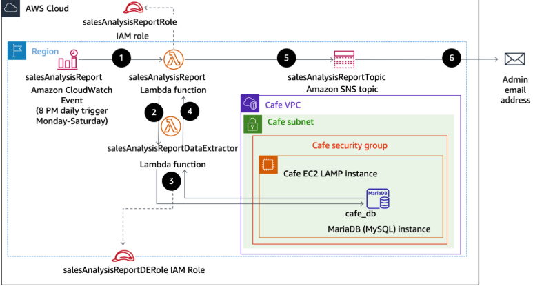
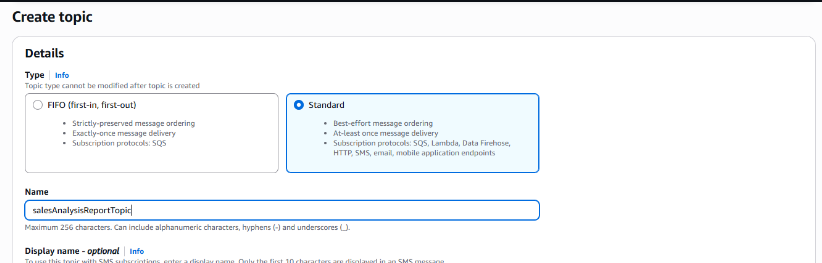
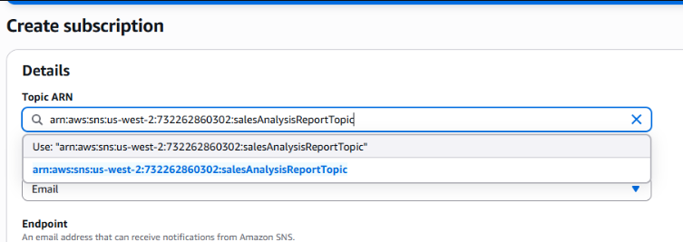
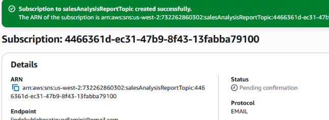
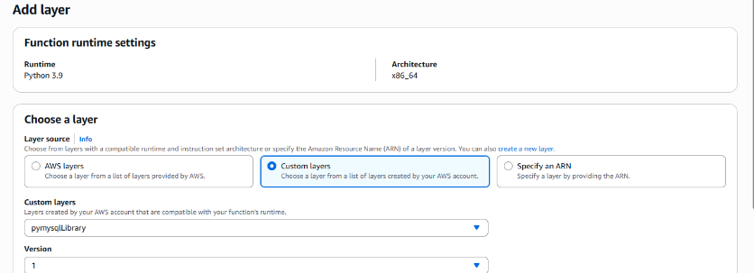
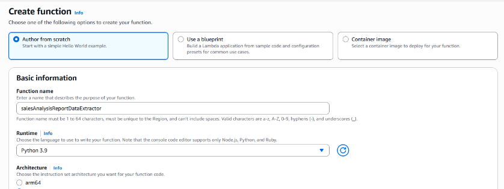
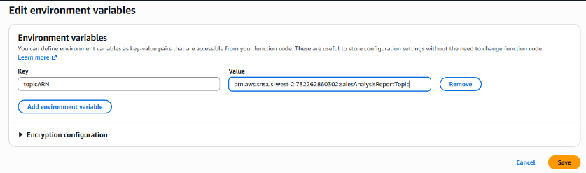
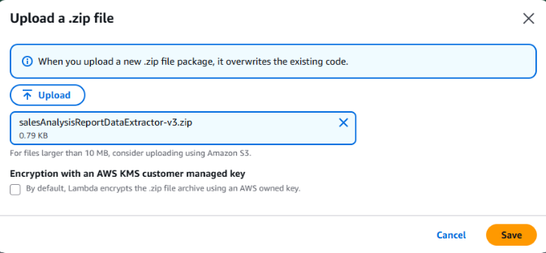
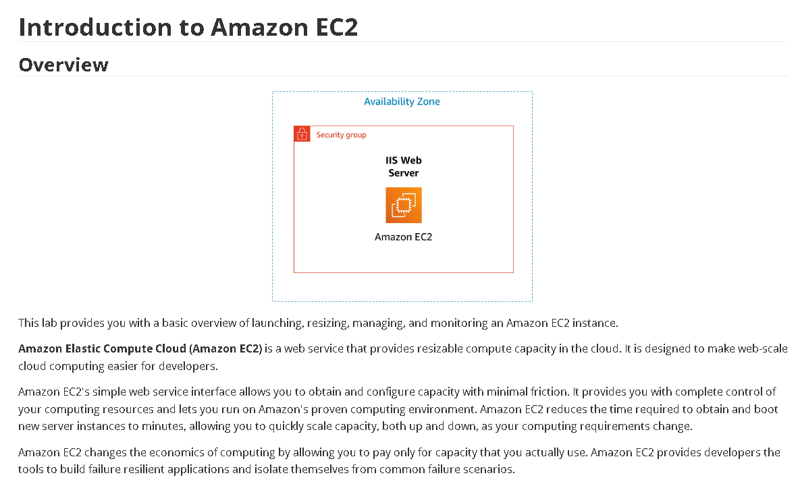

# 🚀 AWS Lambda Serverless Computing Demo

> **Building serverless functions that scale automatically—because who wants to manage servers anyway?**

---

## 📜 What's Inside

- [What I Built Here](#what-i-built-here)
- [Architecture Overview](#architecture-overview)
- [The Lambda Functions](#the-lambda-functions)
- [SNS Integration & Notifications](#sns-integration--notifications)
- [API Gateway & Data Extraction](#api-gateway--data-extraction)
- [What I Learned](#what-i-learned)

---

## What I Built Here

This lab goes deep into **AWS Lambda**—the serverless compute service that lets you run code without thinking about servers. I built a multi-function serverless architecture that handles events, sends notifications, and processes data extractions.

The real value here wasn't just writing Lambda functions—it was understanding how serverless architecture actually works in production:  
💎 **Event-driven architecture** with SNS topics and subscriptions  
💎 **Automated deployments** using Lambda layers and custom runtimes  
💎 **Data processing pipelines** with S3 triggers and API Gateway  
💎 **Cost-effective scaling** that only charges for actual compute time

**Tech Stack:** AWS Lambda, Python 3.9, Amazon SNS, Amazon S3, API Gateway, CloudWatch

---

## Architecture Overview

### How It's Built

This serverless architecture uses multiple Lambda functions that respond to different events—S3 uploads, SNS notifications, and API requests. Everything is event-driven, meaning functions only run when they need to.

<p align="center">
  
</p>

*Serverless architecture showing Lambda functions, SNS topics, and S3 integration*

**The Key Pieces:**
- **Compute Layer:** Multiple Lambda functions handling different events
- **Messaging Layer:** SNS topics for pub/sub notification patterns
- **Storage Layer:** S3 buckets triggering Lambda functions on file uploads
- **API Layer:** API Gateway exposing Lambda functions as REST endpoints

This is the kind of architecture that scales from zero to millions of requests without you touching a single server.

---

## The Lambda Functions

### Function 1: SNS Topic Creation

The first function I built creates an SNS topic programmatically. This is Infrastructure as Code in action—defining resources through Lambda instead of clicking through the console.

<p align="center">
  
</p>

*Creating an SNS topic using Lambda - the serverless way to provision infrastructure*

**What It Does:**
- Creates a new SNS topic with custom naming
- Returns the topic ARN for downstream use
- Handles error cases gracefully
- Logs everything to CloudWatch for debugging

```python
import boto3
import json

def lambda_handler(event, context):
    sns_client = boto3.client('sns')
    
    topic_name = 'MyServerlessTopic'
    response = sns_client.create_topic(Name=topic_name)
    
    return {
        'statusCode': 200,
        'body': json.dumps({
            'message': 'Topic created successfully',
            'topicArn': response['TopicArn']
        })
    }
```

### Function 2: SNS Subscription Management

<p align="center">
  
</p>

*Setting up email subscriptions to SNS topics via Lambda*

This function handles SNS subscriptions—connecting email addresses to topics so they receive notifications when events happen.

**Key Configuration:**

| Component | Value | Why It Matters |
|-----------|-------|----------------|
| **Runtime** | Python 3.9 | Stable, well-supported, great AWS SDK support |
| **Memory** | 128 MB | More than enough for simple API calls |
| **Timeout** | 30 seconds | SNS operations are fast, but we allow buffer time |
| **IAM Role** | Custom execution role | Principle of least privilege—only SNS permissions |

<p align="center">
  
</p>

*Successful subscription creation—user will receive a confirmation email*

**What Makes This Production-Ready:**
- ✓ Input validation on email addresses
- ✓ Proper error handling and logging
- ✓ Returns meaningful status codes
- ✓ Idempotent—running twice won't create duplicates

### Function 3: Custom Lambda Layer

<p align="center">
  
</p>

*Building a custom Lambda layer to package dependencies efficiently*

Lambda layers let you package dependencies separately from your function code. This means faster deployments and cleaner code organization.

**Why Lambda Layers Matter:**
- 📦 **Reusability:** Share code across multiple functions
- 📦 **Smaller packages:** Your function code stays lean
- 📦 **Version control:** Update dependencies without redeploying functions
- 📦 **Faster deploys:** Upload dependencies once, use everywhere

I packaged a custom Python library that multiple functions need. Instead of bundling it with each function (bloat), I created one layer that all functions reference.

### Function 4: Data Extraction Function

<p align="center">
  
</p>

*Building a Lambda function that processes S3 files and extracts data*

This is where things get interesting. This function:
1. Triggers automatically when files land in S3
2. Extracts and transforms data from uploaded files
3. Processes the data using the custom layer
4. Stores results back to S3 or sends to downstream systems

**The Real-World Use Case:**
Think about processing user uploads, parsing CSVs, extracting metadata from images, or transforming data formats. This pattern handles all of that without managing any infrastructure.

<p align="center">
  
</p>

*Configuring environment variables for secure credential management*

**Environment Variables I Used:**
- `BUCKET_NAME` — Target S3 bucket for processed files
- `SNS_TOPIC_ARN` — Topic ARN for completion notifications
- `LOG_LEVEL` — Control logging verbosity
- `PROCESSING_MODE` — Switch between different processing algorithms

No hardcoded values. Everything configurable. That's how you do it right.

---

## SNS Integration & Notifications

### Setting Up the Notification Flow

<p align="center">
  
</p>

*Configuring VPC settings for Lambda functions that need private resource access*

For functions that need to access resources in a VPC (like RDS databases or private APIs), I configured VPC integration with proper subnet selection.

**VPC Best Practices:**
- 🔒 Use private subnets for Lambda functions
- 🔒 Attach NAT Gateway for internet access
- 🔒 Security groups with minimal ingress rules
- 🔒 VPC endpoints for AWS service access (avoid NAT charges)

<p align="center">
  
</p>

*Uploading the Lambda deployment package with all dependencies bundled*

### Testing the Pipeline

<p align="center">
  
</p>

*Using an EC2 instance to simulate file uploads and test the Lambda pipeline*

I spun up a test EC2 instance to simulate real-world file uploads. This lets me verify the entire flow:
1. File uploads to S3
2. Lambda function triggers
3. Data extraction runs
4. SNS notification fires
5. Email arrives with processing results

**Testing Strategy:**
```bash
# Upload test file to S3
aws s3 cp test-data.json s3://my-lambda-bucket/input/

# Check Lambda execution logs
aws logs tail /aws/lambda/DataExtractor --follow

# Verify SNS notification sent
aws sns list-subscriptions --topic-arn <TOPIC_ARN>
```

---

## API Gateway & Data Extraction

### Exposing Lambda via REST API

<p align="center">
  
</p>

*Complete serverless architecture showing Lambda, API Gateway, SNS, and S3 integration*

The final piece was exposing the data extraction function through API Gateway. Now external systems can trigger extractions via HTTP requests.

**API Endpoints Created:**

| Endpoint | Method | What It Does |
|----------|--------|--------------|
| `/extract` | POST | Triggers data extraction for a given S3 key |
| `/status` | GET | Checks extraction job status |
| `/topics` | POST | Creates new SNS topics |
| `/subscribe` | POST | Adds email subscriptions |

**Example API Call:**
```bash
curl -X POST https://api-id.execute-api.us-east-1.amazonaws.com/prod/extract \
  -H "Content-Type: application/json" \
  -d '{
    "bucket": "my-lambda-bucket",
    "key": "input/data.json"
  }'
```

**Response:**
```json
{
  "statusCode": 200,
  "message": "Extraction started",
  "jobId": "extract-12345",
  "estimatedCompletion": "2025-12-16T21:30:00Z"
}
```

---

## What I Learned

### Technical Skills I Practiced

⚙️ **Serverless Architecture**
- Building event-driven systems with Lambda
- Understanding execution models and cold starts
- Designing for stateless, scalable functions

⚙️ **AWS Service Integration**
- Connecting Lambda with SNS, S3, and API Gateway
- Managing IAM roles and permissions
- Using CloudWatch for monitoring and debugging

⚙️ **DevOps & Automation**
- Creating Lambda layers for code reusability
- Environment-based configuration management
- Infrastructure as Code with Lambda-based provisioning

⚙️ **Cost Optimization**
- Pay-per-request pricing model
- Right-sizing memory allocation
- Using layers to reduce deployment package sizes

### The Real Takeaway

This project showed me why serverless is such a game-changer:

- 🎯 **No server management** — AWS handles scaling, patching, availability
- 🎯 **Pay for what you use** — Charged by millisecond, not by hour
- 🎯 **Auto-scaling** — Handles one request or one million
- 🎯 **Event-driven** — Everything reacts to real events, not polling

The shift from "managing servers" to "managing functions" is massive. You stop thinking about infrastructure and start thinking about business logic.

### When to Use Lambda (and When Not To)

**Lambda is great for:**
- Event processing (S3 uploads, SNS messages, API requests)
- Data transformations and ETL pipelines
- Scheduled jobs (via EventBridge)
- Backends for web and mobile apps

**Lambda might not be ideal for:**
- Long-running processes (15-minute max execution time)
- High-memory workloads (10 GB max)
- Applications requiring persistent connections
- Workloads with consistent, predictable traffic (EC2 might be cheaper)

---

## 🧭 Project Status

This is part of my **AWS Restart Journey**, a three-month focused portfolio documenting my path to the AWS Cloud Practitioner certification and beyond.

I'm building real projects, not just following tutorials. The goal is to prove I can actually build things, not just pass exams.

---

## 💭 Let's Connect

If you're looking for someone who's serious about learning AWS the right way—hands-on, documented, and grounded in real-world architecture—let's talk.

<p align="center">
  <a href="mailto:leroym.biz@gmail.com">
    
  </a>
  <a href="https://api.whatsapp.com/send/?phone=27605665116&text=Hi%20Leroy,%20saw%20your%20GitHub!" target="_blank">
    
  </a>
</p>

<p align="center">
  <a href="https://github.com/leroym-biz/AWS-restart-journey" target="_blank">
    
  </a>
</p>

---

<p align="center">
  
  
</p>

<h4 align="center">🚀 Built with AWS Lambda • Python • SNS • API Gateway • Real Serverless Patterns 🚀</h4>