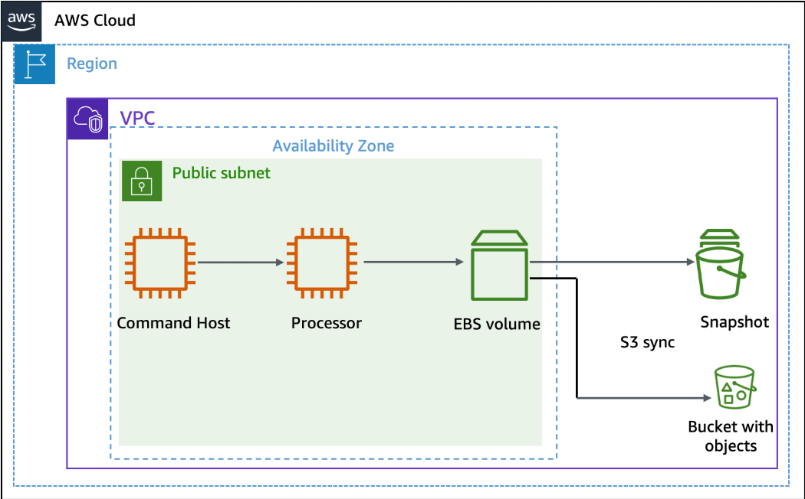
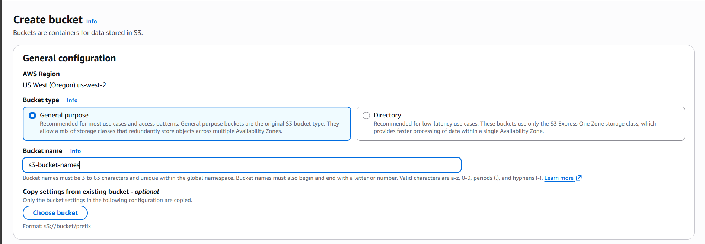
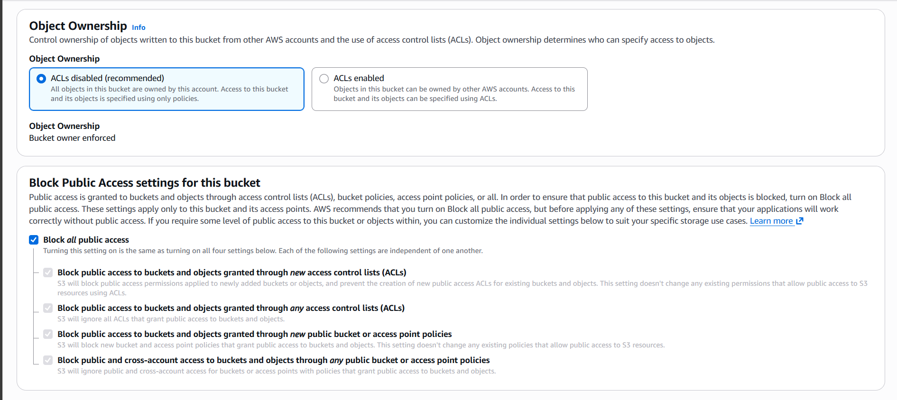
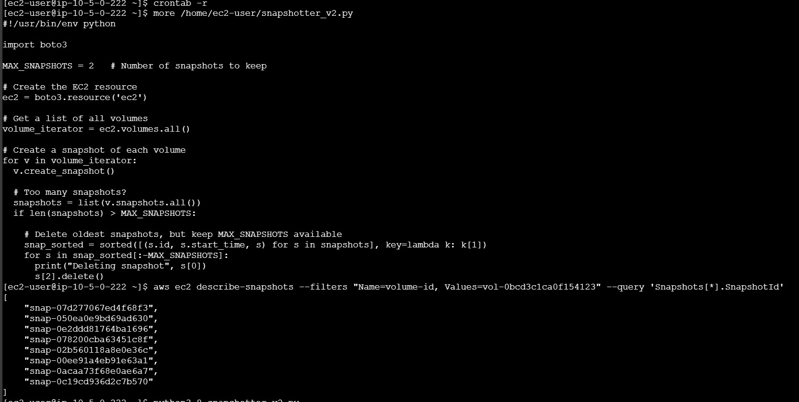
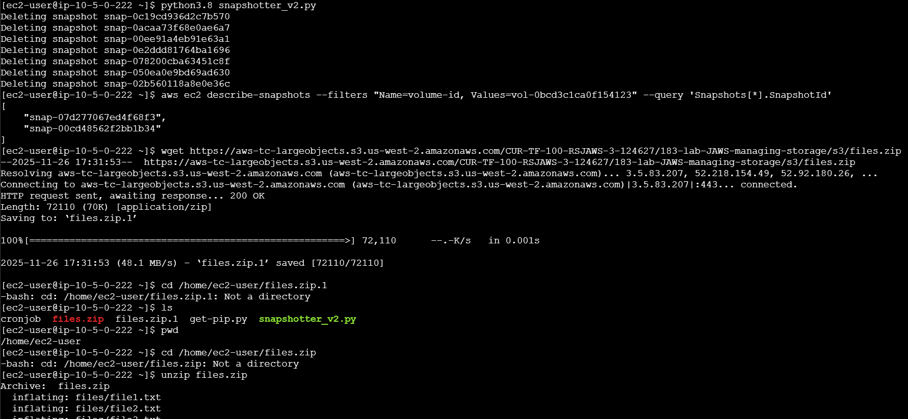
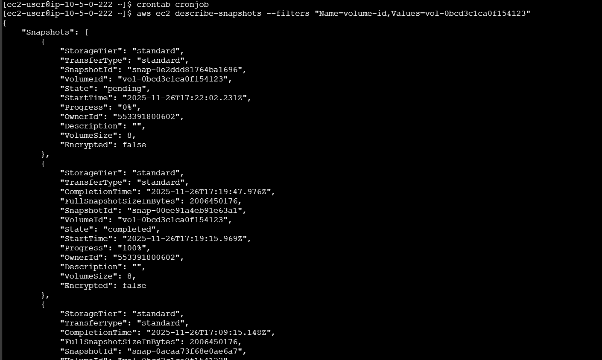
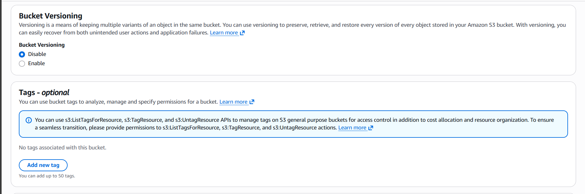
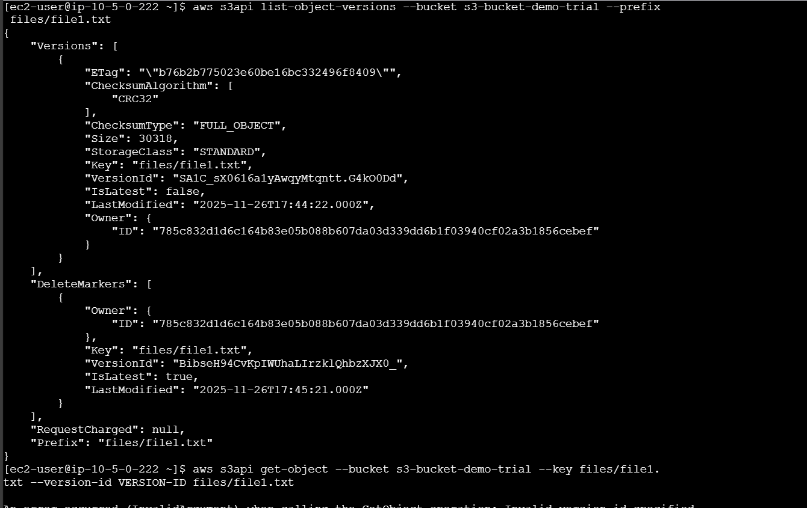
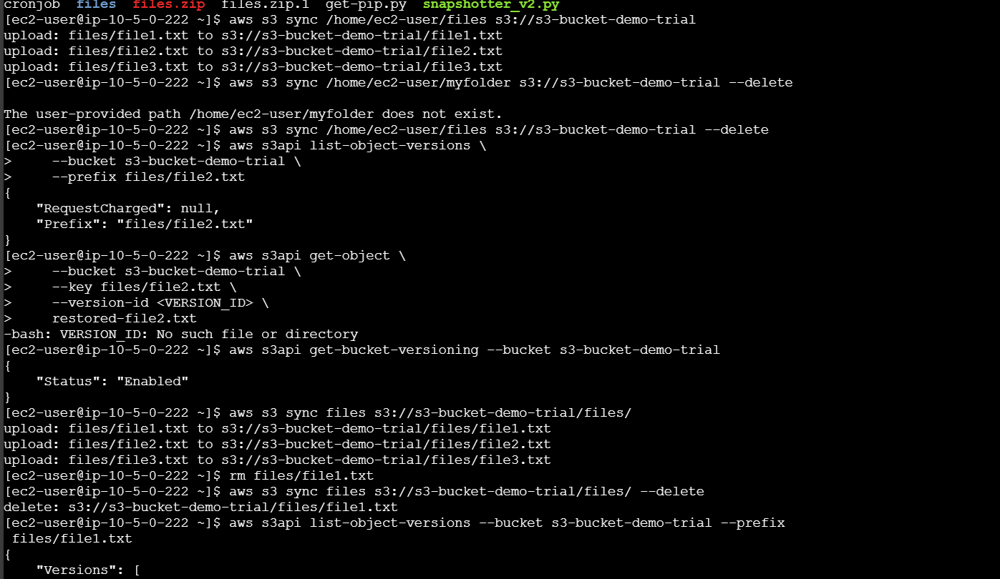
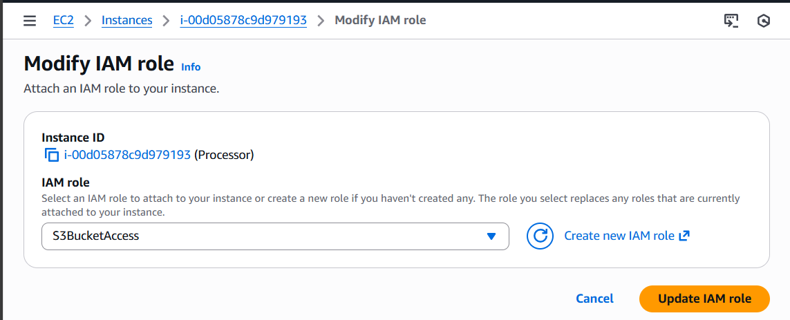

# 🗄️ AWS Storage Management: S3 & EBS Deep Dive

> **Mastering AWS storage solutions—S3 buckets, EBS volumes, snapshots, and versioning. The real-world storage patterns you'll use daily.**

---

## 🗒️ What's Inside

- [What I Built Here](#what-i-built-here)
- [Architecture Overview](#architecture-overview)
- [S3 Bucket Configuration](#s3-bucket-configuration)
- [EBS Volume Management](#ebs-volume-management)
- [Snapshot Strategy & Automation](#snapshot-strategy--automation)
- [S3 Versioning & Sync Operations](#s3-versioning--sync-operations)
- [What I Learned](#what-i-learned)

---

## What I Built Here

This lab covers the essential AWS storage services that every cloud engineer needs to master. I worked with both **Amazon S3** (object storage) and **Amazon EBS** (block storage), implementing real-world patterns for backup, versioning, and disaster recovery.

**What I Actually Did:**  
✨ **Created and secured S3 buckets** with proper permissions and versioning  
✨ **Provisioned and attached EBS volumes** to running EC2 instances  
✨ **Automated snapshot management** using Python and boto3  
✨ **Implemented S3 sync operations** for efficient file transfers  
✨ **Built a complete backup strategy** with versioning and retention policies

**Tech Stack:** AWS S3, Amazon EBS, EC2, Python 3, boto3, AWS CLI, Bash scripting

---

## Architecture Overview

### Storage Architecture Design

AWS offers different storage types for different use cases. This lab demonstrates the relationship between S3 (object storage), EBS (block storage), and EC2 compute instances.

<p align="center">
  
</p>

*S3 sync architecture showing data flow between local storage, S3 buckets, and cross-region replication*

**The Storage Layers:**
- **Object Storage (S3):** Unlimited scalable storage for files, backups, and static assets
- **Block Storage (EBS):** High-performance volumes attached directly to EC2 instances
- **Snapshot Storage:** Point-in-time backups stored in S3, managed by AWS
- **Versioning Layer:** Object-level version control for data protection

The key insight here is understanding when to use S3 versus EBS. S3 is for files you access over HTTP—think backups, logs, media. EBS is for databases and applications that need low-latency block-level access.

---

## S3 Bucket Configuration

### Creating and Securing S3 Buckets

S3 buckets are the foundation of AWS storage. Getting the configuration right from the start saves headaches later.

<p align="center">
  
</p>

*S3 bucket creation dialog showing name and region configuration*

#### Bucket Configuration Settings

| Setting | Value | Why It Matters |
|---------|-------|----------------|
| **Bucket Name** | Globally unique name | Must be unique across ALL AWS accounts worldwide. Use descriptive naming. |
| **Region** | User-selected | Choose based on latency and compliance requirements. |
| **Block Public Access** | Enabled by default | Security best practice—never make buckets public unless absolutely necessary. |
| **Versioning** | Enabled | Protects against accidental deletions and allows rollback. |
| **Encryption** | SSE-S3 | Server-side encryption at rest. Your data is always encrypted. |

<p align="center">
  
</p>

*S3 bucket security settings showing Block Public Access configuration*

### S3 Security Best Practices

🏰 **Object Ownership & Public Access Settings**
- Block all public access by default
- Use IAM roles for EC2 instance access, not access keys
- Enable bucket logging for audit trails
- Implement least privilege with bucket policies

**The Security Mindset:**  
S3 breaches make headlines because of misconfigured permissions. The default should always be "deny everything" and then explicitly grant what's needed. Never the other way around.

---

## EBS Volume Management

### Provisioning Additional Storage

EBS volumes are like external hard drives for your EC2 instances—but better. They persist independently of the instance lifecycle and can be snapshotted, moved, and resized.

<p align="center">
  
</p>

*Creating a new EBS volume with specified size and type*

#### EBS Volume Types I Used

| Volume Type | Size | IOPS | Use Case |
|-------------|------|------|----------|
| **gp3** | 1 GB | 3,000 baseline | General purpose—balanced price and performance |
| **Snapshot-based** | Variable | As configured | Restored from previous snapshots for quick recovery |

### Attaching and Mounting Volumes

<p align="center">
  
</p>

*Attaching an EBS volume to a running EC2 instance*

The attachment process is straightforward through the console, but the real work happens at the OS level:

```bash
# Check available block devices
lsblk

# Create a file system (first time only)
sudo mkfs -t ext4 /dev/xvdf

# Create a mount point
sudo mkdir /mnt/data

# Mount the volume
sudo mount /dev/xvdf /mnt/data

# Verify the mount
df -h
```

<p align="center">
  
</p>

*Successfully mounting a restored EBS volume showing available storage*

**Pro Tip:**  
Always update `/etc/fstab` if you want the volume to mount automatically on reboot. Otherwise, you'll be manually mounting it every time the instance restarts.

---

## Snapshot Strategy & Automation

### Creating EBS Snapshots

Snapshots are incremental backups stored in S3. The first snapshot is a full copy, but subsequent snapshots only store the changed blocks—saving time and money.

<p align="center">
  
</p>

*Creating an EBS snapshot for backup and disaster recovery*

<p align="center">
  
</p>

*Snapshot successfully created and available for restoration*

### Automated Snapshot Management with Python

Manual snapshots are fine for testing, but in production, you need automation. Here's the Python script I wrote using boto3 to manage the snapshot lifecycle:

```python
#!/usr/bin/env python3
"""
EBS Snapshot Automation Script
Creates snapshots, manages retention, and cleans up old backups
"""

import boto3
import sys
from datetime import datetime, timedelta

# Initialize EC2 client
ec2 = boto3.client('ec2')

def create_snapshot(volume_id, description):
    """Create a snapshot of the specified EBS volume"""
    try:
        snapshot = ec2.create_snapshot(
            VolumeId=volume_id,
            Description=description
        )
        print(f"🟢 Snapshot created: {snapshot['SnapshotId']}")
        print(f"  Volume: {volume_id}")
        print(f"  Status: {snapshot['State']}")
        return snapshot['SnapshotId']
    except Exception as e:
        print(f"🔴 Error creating snapshot: {e}")
        sys.exit(1)

def list_snapshots(volume_id):
    """List all snapshots for a specific volume"""
    try:
        response = ec2.describe_snapshots(
            Filters=[
                {'Name': 'volume-id', 'Values': [volume_id]},
                {'Name': 'status', 'Values': ['completed']}
            ],
            OwnerIds=['self']
        )
        
        snapshots = response['Snapshots']
        print(f"\n🎞️ Found {len(snapshots)} snapshot(s):\n")
        
        for snap in sorted(snapshots, key=lambda x: x['StartTime'], reverse=True):
            print(f"  Snapshot ID: {snap['SnapshotId']}")
            print(f"  Created: {snap['StartTime']}")
            print(f"  Size: {snap['VolumeSize']} GB")
            print(f"  Description: {snap.get('Description', 'N/A')}")
            print()
            
        return snapshots
    except Exception as e:
        print(f"🔴 Error listing snapshots: {e}")
        return []

def cleanup_old_snapshots(volume_id, retention_days=7):
    """Delete snapshots older than retention period"""
    cutoff_date = datetime.now(timezone.utc) - timedelta(days=retention_days)
    
    try:
        snapshots = list_snapshots(volume_id)
        deleted_count = 0
        
        for snap in snapshots:
            if snap['StartTime'] < cutoff_date:
                print(f"🗃️  Deleting old snapshot: {snap['SnapshotId']}")
                ec2.delete_snapshot(SnapshotId=snap['SnapshotId'])
                deleted_count += 1
        
        print(f"\n🟢 Cleaned up {deleted_count} old snapshot(s)")
    except Exception as e:
        print(f"🔴 Error during cleanup: {e}")

# Main execution
if __name__ == "__main__":
    VOLUME_ID = "vol-xxxxxxxxx"  # Replace with your volume ID
    DESCRIPTION = f"Automated backup - {datetime.now().strftime('%Y-%m-%d %H:%M')}"
    
    # Create a new snapshot
    snapshot_id = create_snapshot(VOLUME_ID, DESCRIPTION)
    
    # Wait for completion (optional)
    print("\n⏰ Waiting for snapshot to complete...")
    waiter = ec2.get_waiter('snapshot_completed')
    waiter.wait(SnapshotIds=[snapshot_id])
    print("🟢 Snapshot completed successfully!\n")
    
    # List all snapshots
    list_snapshots(VOLUME_ID)
    
    # Cleanup old snapshots (keeping last 7 days)
    cleanup_old_snapshots(VOLUME_ID, retention_days=7)
```

<p align="center">
  
</p>

*Python snapshot automation script using boto3 SDK*

<p align="center">
  
</p>

*Executing the snapshot automation script showing real-time status*

#### Cronjob Configuration for Scheduled Backups

<p align="center">
  
</p>

*Cronjob entry for automated snapshot creation with multiple snapshot states*

**Why Automate Snapshots?**
- 💎 **Consistency:** Backups happen on schedule, not when someone remembers
- 💎 **Cost Control:** Automated cleanup prevents snapshot sprawl
- 💎 **Disaster Recovery:** Multiple point-in-time recovery options
- 💎 **Compliance:** Meet regulatory backup requirements automatically

The snapshot workflow follows this pattern:
1. **Create** → Snapshot begins (state: pending)
2. **Process** → AWS copies changed blocks (state: in-progress)  
3. **Complete** → Snapshot ready for restoration (state: completed)
4. **Retain** → Keep for configured retention period
5. **Cleanup** → Delete snapshots older than retention policy

<p align="center">
  
</p>

*Complete EBS snapshot workflow from creation through restoration*

---

## S3 Versioning & Sync Operations

### Enabling S3 Versioning

Versioning protects against accidental deletions and allows you to retrieve any previous version of an object. Once enabled, S3 keeps every version of every object.

<p align="center">
  
</p>

*S3 bucket with versioning enabled for data protection*

**How Versioning Works:**
- Each object gets a unique version ID
- Deleting an object creates a delete marker (soft delete)
- You can restore previous versions at any time
- Storage costs increase (you pay for all versions)

<p align="center">
  
</p>

*S3 versioning list showing delete markers and version IDs*

### S3 Sync Operations

The AWS CLI `sync` command is incredibly powerful for moving data efficiently between local storage and S3.

```bash
# Sync local directory to S3 (upload)
aws s3 sync /local/path s3://my-bucket-name/ \
  --delete \
  --exclude "*.tmp" \
  --storage-class INTELLIGENT_TIERING

# Sync S3 to local directory (download)
aws s3 sync s3://my-bucket-name/ /local/path

# Sync between S3 buckets (cross-region replication)
aws s3 sync s3://source-bucket/ s3://destination-bucket/ \
  --source-region us-east-1 \
  --region us-west-2
```

<p align="center">
  
</p>

*S3 sync command with --delete flag showing local file deletion after sync*

**What the `--delete` Flag Does:**  
It mirrors the source to the destination by removing files from the destination that don't exist in the source. Use it carefully—this can delete data permanently.

**Sync vs Copy:**
- `sync` only transfers changed files (efficient)
- `cp` copies everything regardless (wasteful)
- Always use `sync` for large datasets or frequent updates

---

## What I Learned

### Technical Skills I Practiced

⚙️ **Storage Architecture**
- Understanding when to use S3 vs EBS vs EFS
- Designing multi-layered backup strategies
- Implementing cost-effective storage tiers

⚙️ **Automation & Scripting**
- Python boto3 SDK for AWS automation
- Cronjob scheduling for recurring tasks
- Error handling and logging in production scripts

⚙️ **Data Protection**
- Snapshot management and retention policies
- S3 versioning for accidental deletion protection
- Cross-region replication for disaster recovery

⚙️ **Security Best Practices**
- IAM roles for service-to-service access
- S3 bucket policies and access control
- Encryption at rest and in transit

### The Real-World Patterns

This lab demonstrates the storage patterns you'll see in production environments:

- 🎖️ **Automated Backup Workflows:** Set it and forget it—backups happen on schedule
- 🎖️ **Disaster Recovery Planning:** Multiple recovery points across regions
- 🎖️ **Cost Optimization:** Automated cleanup prevents storage bloat
- 🎖️ **Security-First Design:** Proper permissions, encryption, and audit logging

The biggest lesson? Storage isn't just about saving files. It's about designing resilient systems that protect data, recover from failures, and scale with your business needs.

**Key Insights:**
- Snapshots are incremental—only changed blocks cost you money after the first one
- S3 versioning is powerful but increases costs—implement lifecycle policies
- Automation isn't optional—manual processes don't scale and create risk
- Testing restores is as important as creating backups—verify your DR plan works

---

## ⚙️ IAM Role Configuration

One critical piece worth highlighting: proper IAM configuration for EC2 to access S3.

<p align="center">
  
</p>

*Attaching IAM role to EC2 instance for secure S3 access without access keys*

**Why IAM Roles Over Access Keys:**
- 🟢 No hardcoded credentials in code
- 🟢 Automatic credential rotation
- 🟢 Temporary security credentials
- 🟢 Easier permission management

Never hardcode AWS access keys in your scripts. Always use IAM roles for EC2 instances.

---

## 📈 Project Status

This is part of my **AWS Restart Journey**, a three-month focused portfolio documenting my path to the AWS Cloud Practitioner certification and beyond.

I'm building real projects, not just following tutorials. The goal is to prove I can actually build things, not just pass exams.

---

## 💬 Let's Connect

If you're looking for someone who understands AWS storage architecture, automation, and real-world cloud patterns—let's talk.

<p align="center">
  <a href="mailto:leroym.biz@gmail.com">
    
  </a>
  <a href="https://api.whatsapp.com/send/?phone=27605665116&text=Hi%20Leroy,%20saw%20your%20GitHub!" target="_blank">
    
  </a>
</p>

<p align="center">
  <a href="https://github.com/leroym-biz/AWS-restart-journey" target="_blank">
    
  </a>
</p>

---

<p align="center">
  
  
</p>

<h4 align="center">🗄️ Built with AWS S3 • EBS • EC2 • Python • boto3 • Real-World Scenarios 🗄️</h4>