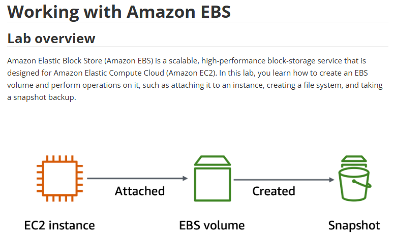
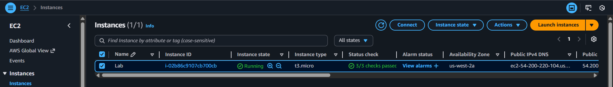
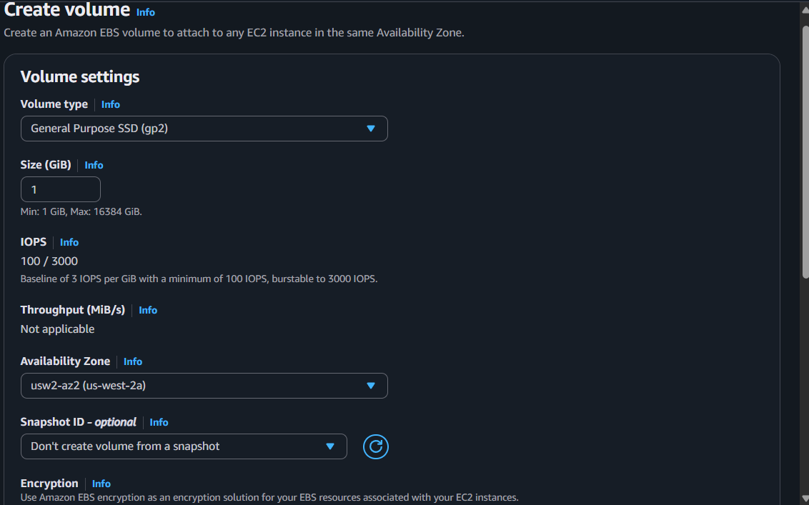
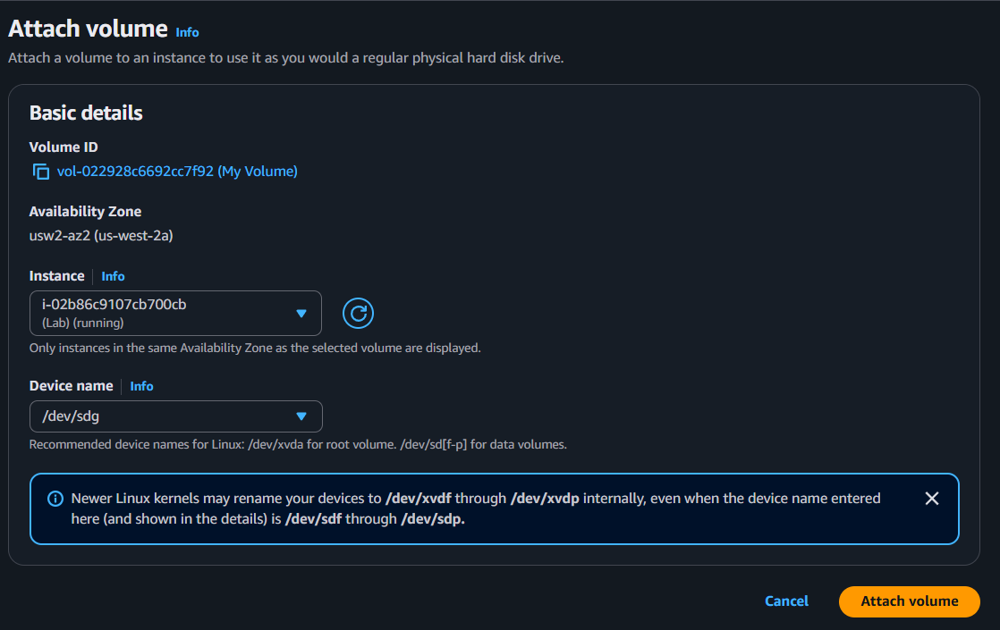
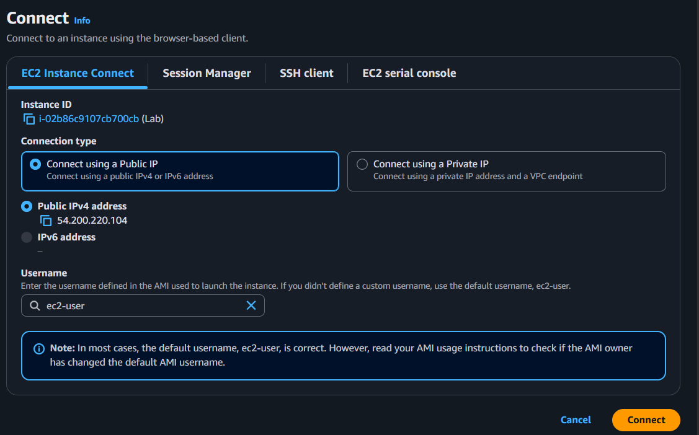

# 🗃️ Working with Amazon EBS

> **Building resilient block storage for EC2 instances—the backbone of persistent data in AWS.**

---

## 🗒️ What's Inside

- [What I Built Here](#what-i-built-here)
- [Understanding EBS Architecture](#understanding-ebs-architecture)
- [Creating and Attaching EBS Volumes](#creating-and-attaching-ebs-volumes)
- [File System Configuration](#file-system-configuration)
- [Snapshot Management](#snapshot-management)
- [Disaster Recovery Testing](#disaster-recovery-testing)
- [What I Learned](#what-i-learned)

---

## What I Built Here

This lab covered Amazon EBS (Elastic Block Store)—the scalable, high-performance block storage service that powers persistent data for EC2 instances.

The real point here wasn't just creating storage volumes—it was understanding production-grade storage patterns:  
✨ **Creating and attaching** EBS volumes to running instances  
✨ **File system configuration** with ext3 and persistent mount points  
✨ **Snapshot backups** for disaster recovery and data protection  
✨ **Volume restoration** from snapshots for business continuity

**Tech Stack:** Amazon EBS (gp2), Amazon EC2, Amazon Linux 2023, ext3 filesystem

---

## Understanding EBS Architecture

### How It Works

Amazon EBS provides block-level storage volumes that persist independently of EC2 instance lifecycles. Think of it as your virtual hard drive in the cloud—data stays intact even if your instance crashes or stops.

<p align="center">
  
</p>

*Amazon EBS architecture showing block storage integrated with EC2 compute instances*

**The Key Pieces:**
- **EBS Volumes:** Network-attached storage that lives in a specific Availability Zone
- **Snapshots:** Point-in-time backups stored in Amazon S3 for durability
- **Volume Types:** Different performance tiers (gp2, gp3, io1, io2) for different workloads
- **Attachment Points:** Volumes mount to EC2 instances via device identifiers (/dev/sdb, /dev/sdc)

**Why This Matters:**
EBS is the foundation of stateful applications in AWS. Databases, file servers, application logs—anything that needs to survive instance failures—lives on EBS.

---

## Creating and Attaching EBS Volumes

### Task 1: Identifying the Lab Instance

Before creating storage, you need to know which Availability Zone your instance is in. EBS volumes must be in the same AZ as the instances they attach to.

<p align="center">
  
</p>

*Lab EC2 instance running in us-west-2a—this determines where we create our EBS volume*

**Key Insight:** EBS volumes are AZ-specific. Cross-AZ attachments aren't allowed. This is why high-availability architectures use multi-AZ deployments with separate volumes.

### Task 2: Creating the EBS Volume

**Volume Configuration:**

| Setting | Value | Why It Matters |
|---------|-------|----------------|
| **Volume Type** | General Purpose SSD (gp2) | Balanced price/performance for most workloads |
| **Size** | 1 GiB | Sufficient for demo; production uses much larger |
| **Availability Zone** | us-west-2a | Must match the EC2 instance location |
| **Name Tag** | My Volume | Organizational best practice for resource tracking |

<p align="center">
  
</p>

*Creating a 1 GiB gp2 EBS volume in the same AZ as our EC2 instance*

**Volume States:**
- **Creating** → Volume is being provisioned
- **Available** → Volume is ready to attach
- **In-use** → Volume is attached to an instance

### Task 3: Attaching the Volume to EC2

Once the volume is available, you attach it to your running instance. The device name (/dev/sdb) is how Linux will reference this storage.

<p align="center">
  
</p>

*Attaching the EBS volume to the Lab instance using device name /dev/sdb*

<p align="center">
  
</p>

*Volume state changes from "Available" to "In-use" after successful attachment*

**Device Naming:**
- `/dev/sdb` — Our new 1 GiB volume
- `/dev/sdc` — Reserved for future volumes (snapshot restore)
- `/dev/sda` or `/dev/nvme0n1` — Root volume (already in use)

---

## File System Configuration

### Task 4: Connecting to the Instance

<p align="center">
  
</p>

*Using EC2 Instance Connect to access the terminal—no SSH keys needed*

### Creating the ext3 File System

Raw EBS volumes are just block devices. Before you can store files, you need a filesystem.

```bash
# View current storage (before adding new volume)
df -h

# Output shows only the root volume (8 GB)
# New volume is attached but not yet visible
```

**Creating the filesystem:**

```bash
# Format the new volume with ext3
sudo mkfs -t ext3 /dev/sdb

# Create mount point directory
sudo mkdir /mnt/data-store

# Mount the volume
sudo mount /dev/sdb /mnt/data-store

# Make the mount persistent across reboots
echo "/dev/sdb   /mnt/data-store ext3 defaults,noatime 1 2" | sudo tee -a /etc/fstab
```

<p align="center">
  
</p>

*Running mkfs to create an ext3 filesystem on the new EBS volume*

### Verifying the Mount

```bash
# Check the configuration file
cat /etc/fstab

# Verify the volume is mounted
df -h
```

<p align="center">
  
</p>

*Output of df -h showing the new volume mounted at /mnt/data-store with 975M available*

**The /etc/fstab entry ensures:**
- Volume mounts automatically after instance reboot
- File system is checked during boot (fsck)
- Proper mount options are applied (noatime for performance)

### Testing the Volume

```bash
# Write test data
sudo sh -c "echo some text has been written > /mnt/data-store/file.txt"

# Verify the file
cat /mnt/data-store/file.txt
# Output: some text has been written
```

Honestly, getting comfortable with mounting and configuring volumes is essential. This is the kind of stuff you do every time you set up a database server or logging system.

---

## Snapshot Management

### Task 5: Creating an EBS Snapshot

Snapshots are incremental backups stored in S3. They're your disaster recovery safety net.

<p align="center">
  
</p>

*Creating a snapshot from the "My Volume" EBS volume*

<p align="center">
  
</p>

*Snapshot status changes from "Pending" to "Completed"—backup is now stored in S3*

**Why Snapshots Matter:**
- **Disaster Recovery:** Restore volumes if data is corrupted or deleted
- **Cross-Region Replication:** Copy snapshots to other AWS regions
- **Account Sharing:** Share snapshots across AWS accounts
- **Version Control:** Keep multiple point-in-time backups

**Snapshot Behavior:**
- Only used blocks are copied (empty space is free)
- Incremental after the first snapshot (only changed blocks)
- Stored in S3 with 11 9's of durability

### Testing Data Loss

```bash
# Delete the test file
sudo rm /mnt/data-store/file.txt

# Verify deletion
ls /mnt/data-store/file.txt
# Output: ls: cannot access /mnt/data-store/file.txt: No such file or directory
```

This simulates accidental data loss. Now let's recover it from the snapshot.

---

## Disaster Recovery Testing

### Task 6.1: Creating a Volume from Snapshot

This is where snapshots prove their worth. You can restore the entire volume from a point-in-time backup.

<p align="center">
  
</p>

*Creating a new EBS volume from "My Snapshot"—instant disaster recovery*

**Configuration Options:**
- Same size as original, or larger (can't shrink)
- Same AZ, or different (for cross-AZ recovery)
- Different volume type (upgrade from gp2 to gp3, for example)

### Task 6.2: Mounting the Restored Volume

```bash
# Create new mount point
sudo mkdir /mnt/data-store2

# Mount the restored volume
sudo mount /dev/sdc /mnt/data-store2

# Verify file recovery
ls /mnt/data-store2/file.txt
# Success! The file is back.

cat /mnt/data-store2/file.txt
# Output: some text has been written
```

<p align="center">
  
</p>

*Restored volume mounted at /mnt/data-store2 with original data intact—disaster recovery successful*

**What Just Happened:**
1. Original volume had data
2. We created a snapshot (backup)
3. We deleted the data (simulated failure)
4. We restored from snapshot to a new volume
5. The data is back—zero data loss

This is exactly how production disaster recovery works.

---

## What I Learned

### Technical Skills I Practiced

🔧 **Storage Architecture**
- Understanding EBS volume types and use cases
- Knowing when to use gp2 vs gp3 vs io1
- Planning for Availability Zone constraints

🔧 **Linux System Administration**
- Creating and formatting filesystems (mkfs)
- Mounting volumes and editing /etc/fstab
- Understanding device naming conventions

🔧 **Backup & Recovery**
- Creating point-in-time snapshots
- Restoring volumes from snapshots
- Testing disaster recovery procedures

🔧 **Production Operations**
- Persistent mount configuration
- Data integrity verification
- Capacity planning and monitoring

### The Real Takeaway

This project isn't complicated, but it touches on everything that matters for production storage:

- 💡 Building persistent storage that survives instance failures
- 💡 Implementing backup strategies for disaster recovery
- 💡 Understanding the relationship between volumes, snapshots, and S3
- 💡 Testing recovery procedures before you actually need them

Honestly, the snapshot/restore workflow is something you'll use constantly in production:

**Real-world examples:**
- **Database migrations:** Snapshot prod DB, restore to dev environment
- **Pre-deployment backups:** Snapshot before risky changes, roll back if needed
- **Cross-region DR:** Copy snapshots to another region for geographic redundancy
- **Development environments:** Create dev instances from production snapshots

The key insight: **EBS volumes are ephemeral attachments, but snapshots are durable backups. Know the difference.**

### Storage Best Practices

| Scenario | Recommendation |
|----------|---------------|
| **Root volumes** | Use gp3 for better price/performance than gp2 |
| **Databases** | Use io1/io2 for consistent IOPS-heavy workloads |
| **Boot volumes** | Enable EBS encryption by default |
| **Backup strategy** | Automate daily snapshots with lifecycle policies |
| **Cross-AZ HA** | Use multi-AZ deployments with separate volumes |

---

## 📈 Project Status

This is part of my **AWS Restart Journey**, a three-month focused portfolio documenting my path to the AWS Cloud Practitioner certification and beyond.

I'm building real projects, not just following tutorials. The goal is to prove I can actually build things, not just pass exams.

---

## 🤝 Let's Connect

If you're looking for someone who's serious about learning AWS the right way—hands-on, documented, and grounded in real-world architecture—let's talk.

<p align="center">
  <a href="mailto:leroym.biz@gmail.com">
    
  </a>
  <a href="https://api.whatsapp.com/send/?phone=27605665116&text=Hi%20Leroy,%20saw%20your%20GitHub!" target="_blank">
    
  </a>
</p>

<p align="center">
  <a href="https://github.com/leroym-biz/AWS-restart-journey" target="_blank">
    
  </a>
</p>

---

<p align="center">
  
  
</p>

<h4 align="center">🖴 Built with AWS EBS • EC2 • Linux • Snapshot Management • Real-World Storage 🚀</h4>