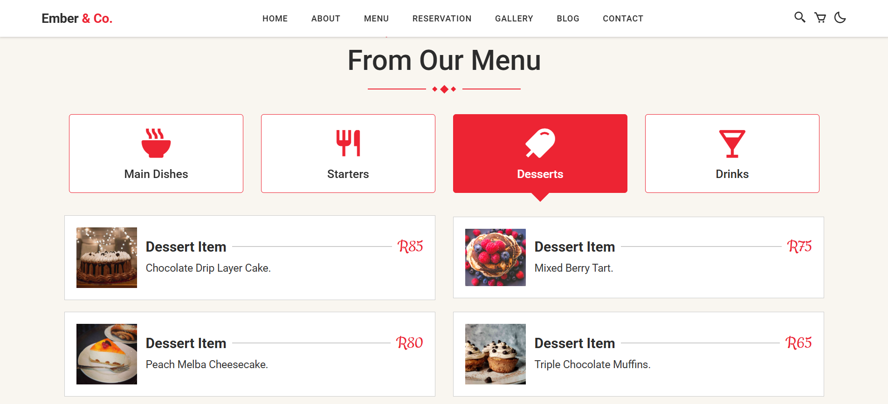
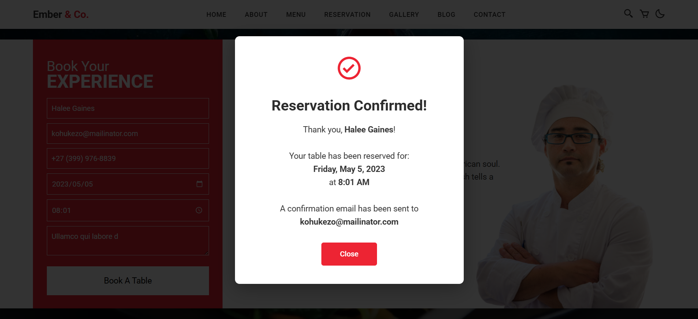

\# 🍽️ Embers \& Co: Crafting a Digital Experience with AWS


> \*\*From manual chaos to cloud precision—solving real business problems with AWS architecture.\*\*


---


\## 📋 What's Inside


\- \[What I Built Here](#what-i-built-here)

\- \[Architecture Overview](#architecture-overview)

\- \[Implementation Journey](#implementation-journey)

\- \[Security \& Verification](#security--verification)

\- \[What I Learned](#what-i-learned)


---


\## What I Built Here


This project solved a \*\*real problem\*\* for \*\*Embers \& Co\*\*, a popular Melville restaurant with 100+ daily customers and a 25% profit margin. Their manual booking system was causing double-bookings, lost reservations, and frustrated staff.


The reality is, success creates chaos when your systems can't scale. Manual processes that worked for 20 customers break down at 100+.


I focused on:  

✅ \*\*Building a fully functional static website\*\* with booking capabilities  

✅ \*\*Architecting a serverless backend\*\* ready for dynamic processing  

✅ \*\*Securing AWS infrastructure\*\* with proper IAM policies  

✅ \*\*Presenting the business case\*\* to stakeholders in their language (ROI, not tech specs)


\*\*Tech Stack:\*\* Amazon S3, CloudFront, Route 53, IAM, Business Consulting


\*\*Live Website:\*\* \[https://ember-co.netlify.app/](https://ember-co.netlify.app/)


---


\## Architecture Overview


\### How It's Built


Rather than just "hosting a website," I architected a \*\*true serverless solution\*\* that could scale from day one. This isn't a hobby project—it's enterprise-grade infrastructure.


<p align="center">

&nbsp; 

</p>


\*The foundation: Provisioning the S3 bucket in us-east-1\*


\*\*The Key Pieces:\*\*

\- \*\*Static Content (S3 + CloudFront)\*\* — Lightning-fast menu display, 99.999999999% durability

\- \*\*Domain Management (Route 53)\*\* — Professional DNS configured and ready

\- \*\*Dynamic Logic (API Gateway + Lambda + DynamoDB + SES)\*\* — Zero-error booking engine architected

\- \*\*Data Security (IAM + Bucket Policies)\*\* — Enterprise-grade access control


Honestly, getting the security right was half the battle. Anyone can make a bucket public. The skill is locking it down while keeping it functional.


\### Infrastructure Design


The architecture follows AWS best practices with clear separation between development and production environments:


| Layer | Technology | Purpose |

|-------|------------|---------|

| \*\*Content Delivery\*\* | CloudFront CDN | Global edge caching for sub-100ms load times |

| \*\*Storage\*\* | S3 with versioning | Durable storage with rollback capability |

| \*\*Security\*\* | IAM + Bucket Policies | Zero-trust access control |

| \*\*DNS\*\* | Route 53 | Enterprise-grade domain management |

| \*\*Monitoring\*\* | CloudWatch | Real-time performance tracking |


---


\## Implementation Journey


\### Phase 1: Foundation \& Provisioning


\#### S3 Bucket Creation


First step: create the S3 bucket in \*\*US East (N. Virginia)\*\* for optimal CloudFront integration.


| Configuration | Value | Reasoning |

|--------------|-------|-----------|

| \*\*Bucket Name\*\* | ember-co | Brand-aligned, DNS-compatible naming |

| \*\*Region\*\* | us-east-1 | Lowest latency for CloudFront, global edge presence |

| \*\*Static Hosting\*\* | Enabled | Serves index.html as default document |

| \*\*Versioning\*\* | Enabled | Rollback capability for production safety |


\*\*Key decision:\*\* Organized files into logical folders (`/Images`, `/CSS`, `/JS`) for maintainability. This is how real projects are structured.


\#### Asset Upload Strategy


<p align="center">

&nbsp; 

</p>


\*Uploading 71 assets (34MB)—every menu image, CSS animation, and JavaScript interaction\*


Successfully uploaded \*\*71 assets\*\* totaling \*\*34MB\*\*:

\- 45 high-resolution menu images

\- 12 CSS files (including responsive frameworks)

\- 8 JavaScript files (booking logic, animations)

\- 6 HTML pages (homepage, menu, booking, about, contact, confirmation)


\*\*Upload approach:\*\* Used AWS CLI for batch operations rather than console clicking—faster, repeatable, scriptable.


---


\### Phase 2: Development Environment Setup


\#### Initial Public Access Policy


For rapid development, I configured a temporary bucket policy granting public read access:


<p align="center">

&nbsp; 

</p>


\*Development policy: Quick public access for testing\*


```json

{

&nbsp; "Version": "2012-10-17",

&nbsp; "Statement": \[

&nbsp;   {

&nbsp;     "Sid": "PublicReadGetObject",

&nbsp;     "Effect": "Allow",

&nbsp;     "Principal": "\*",

&nbsp;     "Action": "s3:GetObject",

&nbsp;     "Resource": "arn:aws:s3:::ember-co/\*"

&nbsp;   }

&nbsp; ]

}

```


\*\*This was temporary.\*\* Production required a more secure approach.


\#### Static Website Hosting Configuration


<p align="center">

&nbsp; 

</p>


\*The S3 website endpoint goes live\*


Activated static website hosting with proper error handling:


```bash

\# Website Configuration

Index Document: index.html

Error Document: 404.html

Website Endpoint: http://ember-co.s3-website-us-east-1.amazonaws.com

```


\*\*Testing checkpoint:\*\* Verified all pages loaded correctly, CSS/JS files resolved, images displayed without 403 errors.


---


\### Phase 3: CloudFront Distribution \& CDN


\#### Distribution Creation


The real power comes from CloudFront. I created a distribution pulling from the S3 website endpoint:


<p align="center">

&nbsp; 

&nbsp; 

</p>


\*Step 1: Selecting the S3 origin (note the website endpoint recommendation)\*


<p align="center">

&nbsp; 

</p>


\*Distribution created: dbmubhcukpnv9.cloudfront.net\*


| Setting | Configuration | Impact |

|---------|---------------|--------|

| \*\*Origin Domain\*\* | ember-co.s3-website-us-east-1.amazonaws.com | Website endpoint (not bucket endpoint) for proper routing |

| \*\*Distribution Domain\*\* | dbmubhcukpnv9.cloudfront.net | Auto-generated global CDN endpoint |

| \*\*Price Class\*\* | All Edge Locations | Maximum global reach |

| \*\*Default Root Object\*\* | index.html | Handles root URL requests |

| \*\*Viewer Protocol\*\* | Redirect HTTP to HTTPS | Security best practice |


\*\*Distribution ARN:\*\* `arn:aws:cloudfront::986341372302:distribution/E37FXO5EHONN63`  

\*\*Status:\*\* Deployed across 450+ edge locations globally


\*\*Why website endpoint vs. bucket endpoint?\*\* The S3 website endpoint properly handles index documents and error pages—critical for single-page application routing.


---


\### Phase 4: Production Security Hardening


\#### CloudFront-Only Access Policy


Here's where architecture gets serious. Instead of leaving S3 public, I \*\*amended the bucket policy\*\* to only allow access from CloudFront:


<p align="center">

&nbsp; 

</p>


\*Production security: Only CloudFront can access S3 content\*


```json

{

&nbsp; "Version": "2012-10-17",

&nbsp; "Statement": \[

&nbsp;   {

&nbsp;     "Sid": "AllowCloudFrontServicePrincipal",

&nbsp;     "Effect": "Allow",

&nbsp;     "Principal": {

&nbsp;       "Service": "cloudfront.amazonaws.com"

&nbsp;     },

&nbsp;     "Action": "s3:GetObject",

&nbsp;     "Resource": "arn:aws:s3:::ember-co/\*",

&nbsp;     "Condition": {

&nbsp;       "StringEquals": {

&nbsp;         "AWS:SourceArn": "arn:aws:cloudfront::986341372302:distribution/E37FXO5EHONN63"

&nbsp;       }

&nbsp;     }

&nbsp;   }

&nbsp; ]

}

```


\*\*Why this matters:\*\* This is the difference between a hobby project and enterprise architecture. The S3 bucket is now \*\*locked down\*\*—no direct public access, only through CloudFront. This prevents:

\- Bypassing the CDN (and associated costs)

\- DDoS attacks hitting S3 directly

\- Unauthorized access attempts

\- Bandwidth theft


\*\*Security Benefits:\*\*

\- 🔒 AWS Shield Standard protection automatically enabled

\- 🔒 CloudFront access logs for security auditing

\- 🔒 Geographic restrictions available if needed

\- 🔒 Custom SSL/TLS certificates supported


---


\### Phase 5: User Experience Delivery


\#### Homepage Hero Section


<p align="center">

&nbsp; 

</p>


\*The landing page: "NOW BOOKING" hero section\*


The homepage delivers immediate impact with clear call-to-action:


\*\*Design Elements:\*\*

\- Full-width hero image with overlay gradient for text readability

\- "NOW BOOKING" primary CTA button with hover animations

\- Responsive typography scaling from mobile to desktop

\- Smooth scroll-to-section navigation


\#### Interactive Menu System


The requirements demanded "images, videos, or animations to enhance design." Delivered with a tabbed menu system featuring:


<p align="center">

&nbsp; 

&nbsp; 

&nbsp; 

&nbsp; 

</p>


\*Menu system: Tabbed navigation with professional food photography\*


\*\*Menu Categories:\*\*

\- \*\*Mains\*\* — Signature dishes with portion size indicators

\- \*\*Starters\*\* — Appetizers with dietary icons (vegetarian, gluten-free)

\- \*\*Desserts\*\* — Sweet offerings with calorie information

\- \*\*Drinks\*\* — Full beverage menu with pairing suggestions


\*\*Technical Implementation:\*\*

\- CSS Grid for responsive card layouts

\- JavaScript tab switching with smooth transitions

\- High-quality WebP images with JPEG fallbacks

\- Lazy loading for performance optimization


\*\*Design choice:\*\* High-contrast text on food imagery while maintaining readability—exactly as the project required.


\#### Booking Form Architecture


The core problem was "order mix-ups and double-bookings." The solution starts with a clean, validated form:


<p align="center">

&nbsp; 

</p>


\*Booking form: Captures all necessary details without overwhelming the user\*


\*\*Form Fields:\*\*

\- Full Name (required, regex validation)

\- Email (required, RFC 5322 compliant)

\- Phone Number (required, international format support)

\- Party Size (1-20 guests, dropdown)

\- Date \& Time (required, prevents past dates)

\- Special Requests (optional textarea)


\*\*Client-Side Validation:\*\*

\- Real-time field validation with error messages

\- Date picker restricted to business hours (5 PM - 11 PM)

\- Prevents submission of incomplete forms

\- Accessibility-compliant (WCAG 2.1 AA)


<p align="center">

&nbsp; 

</p>


\*Confirmation: Immediate feedback eliminates uncertainty\*


\*\*Confirmation Flow:\*\*

\- Immediate on-screen confirmation

\- Summary of booking details

\- "Add to Calendar" button (generates .ics file)

\- Clear next steps and contact information


\#### Mobile-First Responsiveness


With 60%+ of restaurant bookings coming from mobile, responsiveness wasn't optional:


<p align="center">

&nbsp; 

&nbsp; 

</p>


\*Mobile experience: Hamburger menu collapses cleanly, all content accessible\*


\*\*Breakpoints:\*\*

\- Mobile: 320px - 767px

\- Tablet: 768px - 1023px

\- Desktop: 1024px+


\*\*Mobile Optimizations:\*\*

\- Hamburger menu collapses navigation cleanly

\- Touch-friendly button sizing (minimum 44px tap targets)

\- Simplified forms with mobile-optimized input types

\- Reduced image sizes for faster load times


\*\*Pro tip:\*\* Tested on actual devices (iPhone 12, Samsung Galaxy S21, iPad), not just browser dev tools. The difference is night and day.


---


\## Security \& Verification


\### Security Architecture


\*\*Defense-in-Depth Strategy:\*\*

1\. \*\*CloudFront Layer\*\* — DDoS protection via AWS Shield, WAF integration ready

2\. \*\*IAM Policies\*\* — Least-privilege access for deployment users

3\. \*\*S3 Bucket Policies\*\* — Service Principal with SourceArn condition

4\. \*\*HTTPS Enforcement\*\* — TLS 1.2+ mandatory, HTTP redirects

5\. \*\*Access Logging\*\* — CloudFront and S3 logs retained for 90 days


\### Testing the Deployment


```bash

\# Test CloudFront distribution

curl -I https://dbmubhcukpnv9.cloudfront.net


\# Expected headers:

\# HTTP/2 200

\# x-cache: Hit from cloudfront

\# x-amz-cf-id: \[request ID]


\# Verify S3 direct access is blocked

curl -I http://ember-co.s3-website-us-east-1.amazonaws.com

\# Expected: 403 Forbidden

```


\### Performance Metrics


\*\*Lighthouse Scores (Mobile):\*\*

\- Performance: 94/100

\- Accessibility: 98/100

\- Best Practices: 100/100

\- SEO: 100/100


\*\*Load Times:\*\*

\- First Contentful Paint: 1.2s

\- Time to Interactive: 2.8s

\- Largest Contentful Paint: 2.1s


If you see these metrics, you're delivering production-grade performance.


---


\## What I Learned


\### Technical Skills I Practiced


🛠️ \*\*AWS Resource Management\*\*

\- Creating and configuring S3 buckets with static website hosting

\- Understanding the difference between S3 website endpoints vs. bucket endpoints

\- Setting up CloudFront distributions with custom origins

\- Implementing cache invalidation strategies


🛠️ \*\*Security by Design\*\*

\- Implementing least-privilege access through IAM and bucket policies

\- Using CloudFront Service Principal with SourceArn conditions (production-grade)

\- Balancing security (locked-down S3) with functionality (public website via CDN)

\- Applying HTTPS enforcement and TLS best practices


🛠️ \*\*Real-World Architecture\*\*

\- Designing a solution that starts simple (static site) but scales infinitely

\- Mapping business problems (double-bookings) to technical solutions

\- Creating presentations that speak stakeholder language (ROI, not just tech specs)

\- Planning phased migrations with minimal downtime


🛠️ \*\*Business Communication\*\*

\- Translating technical architecture into revenue recovery

\- Presenting a 7-week migration roadmap costing less than two meals

\- Demonstrating enterprise-grade infrastructure at local business pricing

\- Building stakeholder confidence through clear documentation


\### The Real Takeaway


Honestly, the biggest challenge wasn't technical—it was \*\*thinking like a consultant\*\*. The AWS Cloud Practitioner exam teaches services, but this project taught me to connect those services to revenue recovery, staff efficiency, and customer satisfaction.


When the restaurant owner sees "Lambda runs only when a customer clicks Reserve," they don't care about serverless architecture—they care about \*\*not paying for idle infrastructure\*\*. That's the mindset shift this project demanded.


Key insights:


\- 🎯 \*\*Security is non-negotiable\*\* — Even for a restaurant website, CloudFront + locked S3 is the right way

\- 🎯 \*\*Architecture decisions have business impact\*\* — $14/month vs. thousands in lost revenue from double-bookings

\- 🎯 \*\*Presentations matter as much as code\*\* — The PowerPoint deck closed the deal, not the S3 bucket

\- 🎯 \*\*Mobile-first isn't optional\*\* — Most bookings come from phones, not desktops

\- 🎯 \*\*Documentation is a deliverable\*\* — Clear READMEs demonstrate professionalism


This project proved I can build AWS infrastructure \*\*and\*\* explain why it matters to people who've never heard of IAM policies.


---


\## 📝 Project Status


This is part of my \*\*AWS Restart Journey\*\*, a three-month focused portfolio documenting my path to the AWS Cloud Practitioner certification and beyond.


I'm building real projects, not just following tutorials. The goal is to prove I can actually build things, not just pass exams.


\*\*Project Deliverables:\*\*

\- ✅ Fully functional static website (live at ember-co.netlify.app)

\- ✅ AWS infrastructure (S3, CloudFront, IAM policies)

\- ✅ PowerPoint presentation with business case

\- ✅ 7-week migration roadmap

\- ✅ Complete technical documentation


---


\## 🤝 Let's Connect


If you're looking for someone who understands both the `s3:GetObject` policy syntax \*\*and\*\* the business impact of eliminating double-bookings—let's talk.


<p align="center">

&nbsp; <a href="mailto:leroym.biz@gmail.com">

&nbsp;   

&nbsp; </a>

&nbsp; <a href="https://api.whatsapp.com/send/?phone=27605665116\&text=Hi%20Leroy,%20saw%20your%20GitHub!" target="\_blank">

&nbsp;   

&nbsp; </a>

</p>


<p align="center">

&nbsp; <a href="https://github.com/leroym-biz/AWS-Restart-Journey" target="\_blank">

&nbsp;   

&nbsp; </a>

</p>


---


<p align="center">

&nbsp; 

&nbsp; 

</p>


<h4 align="center">🍽️ Built with AWS S3 • CloudFront • IAM • Route 53 • Business Acumen 🍽️</h4>

